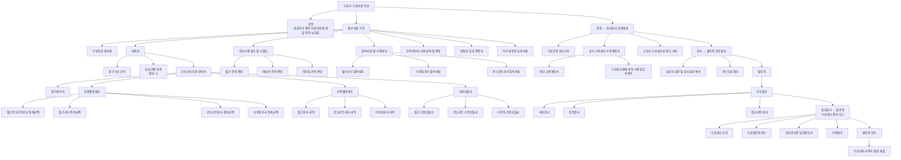
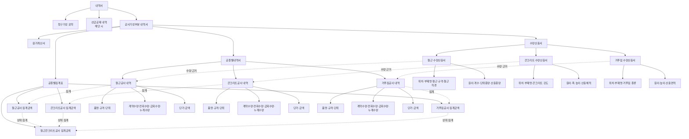
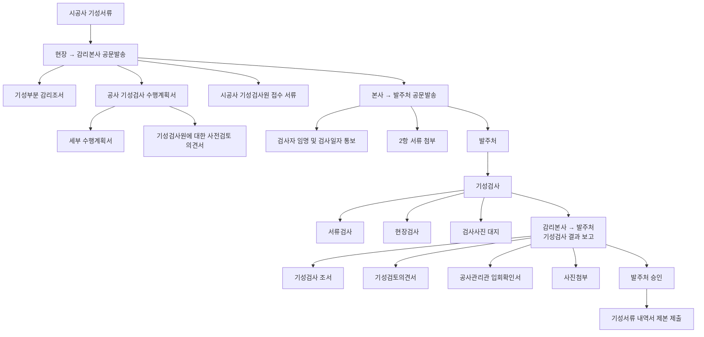

# 철근콘크리트 공종 기성서류 문서 흐름도

## 1. 전체 문서 흐름도

```mermaid
flowchart TD
    A[시공사 기성서류 작성] --> A1[공문\n대표이사 명의 사용인감계 제출 직인 날인본]
    A --> A2[첨부서류 구성]

    A2 --> B1[기성부분 검사원]
    A2 --> B2[내역서]
    A2 --> B3[주요자재 검수 및 수불부]
    A2 --> B4[검측서류 및 사진대지]
    A2 --> B5[안전관리비 사용내역 및 증빙]
    A2 --> B6[보험료 납입 증명서]
    A2 --> B7[기타 발주처 요청서류]

    B2 --> C1[청구기성 요약]
    B2 --> C2[선금공제 내역\n해당 시]
    B2 --> C3[공사기성부분 내역서]

    C3 --> D1[원가계산서]
    C3 --> D2[공종별집계표]
    C3 --> D3[공종별내역서]
    C3 --> D4[수량산출서]

    D2 --> E1[철근콘크리트공사 집계금액]
    D2 --> E2[철근공사 집계금액]
    D2 --> E3[콘크리트공사 집계금액]
    D2 --> E4[거푸집공사 집계금액]

    D3 --> F1[철근공사 내역]
    D3 --> F2[콘크리트공사 내역]
    D3 --> F3[거푸집공사 내역]

    D4 --> G1[철근 수량산출서]
    D4 --> G2[콘크리트 수량산출서]
    D4 --> G3[거푸집 수량산출서]

    B3 --> H1[철근 관련 증빙]
    B3 --> H2[레미콘 관련 증빙]
    B3 --> H3[거푸집 관련 증빙]

    B4 --> I1[철근공사 검측서류]
    B4 --> I2[거푸집공사 검측서류]
    B4 --> I3[콘크리트공사 검측서류]

    A --> J[현장 → 감리본사 공문발송]
    J --> J1[기성부분 감리조서]
    J --> J2[공사 기성검사 수행계획서]
    J2 --> J2a[세부 수행계획서]
    J2 --> J2b[기성검사원에 대한 사전검토 의견서]
    J --> J3[시공사 기성검사원 접수 서류]

    J --> K[본사 → 발주처 공문발송]
    K --> K1[검사자 임명 및 검사일자 통보]
    K --> K2[2항 서류 첨부]

    K --> L[발주처]
    L --> M[기성검사]
    M --> M1[서류검사]
    M --> M2[현장검사]
    M --> M3[검사사진 대지]

    M --> N[감리본사 → 발주처\n기성검사 결과 보고]
    N --> N1[기성검사 조서]
    N --> N2[기성검토의견서]
    N --> N3[공사관리관 입회확인서]
    N --> N4[사진첨부]

    N --> O[발주처 승인]
    O --> P[기성서류 내역서 제본 제출]
```

---

## 2. 내역서 내부 흐름도

```mermaid
flowchart TD
    A[내역서] --> B[청구기성 요약]
    A --> C[선금공제 내역\n해당 시]
    A --> D[공사기성부분 내역서]

    D --> E[원가계산서]
    D --> F[공종별집계표]
    D --> G[공종별내역서]
    D --> H[수량산출서]

    F --> F1[철근콘크리트공사 집계금액]
    F --> F2[철근공사 집계금액]
    F --> F3[콘크리트공사 집계금액]
    F --> F4[거푸집공사 집계금액]

    G --> G1[철근공사 내역]
    G --> G2[콘크리트공사 내역]
    G --> G3[거푸집공사 내역]

    G1 --> G1a[품명·규격·단위]
    G1 --> G1b[계약수량·전회수량·금회수량·누계수량]
    G1 --> G1c[단가·금액]

    G2 --> G2a[품명·규격·단위]
    G2 --> G2b[계약수량·전회수량·금회수량·누계수량]
    G2 --> G2c[단가·금액]

    G3 --> G3a[품명·규격·단위]
    G3 --> G3b[계약수량·전회수량·금회수량·누계수량]
    G3 --> G3c[단가·금액]

    H --> H1[철근 수량산출서]
    H --> H2[콘크리트 수량산출서]
    H --> H3[거푸집 수량산출서]

    H1 --> H1a[위치·부재명·철근 규격·철근 직경]
    H1 --> H1b[길이·개수·단위중량·산출중량]

    H2 --> H2a[위치·부재명·콘크리트 강도]
    H2 --> H2b[길이·폭·높이·산출체적]

    H3 --> H3a[위치·부재명·거푸집 종류]
    H3 --> H3b[길이·높이·산출면적]

    H1 -.수량 근거.-> G1
    H2 -.수량 근거.-> G2
    H3 -.수량 근거.-> G3

    G1 -.집계.-> F2
    G2 -.집계.-> F3
    G3 -.집계.-> F4
    F2 -.상위 집계.-> F1
    F3 -.상위 집계.-> F1
    F4 -.상위 집계.-> F1
```

---

## 3. 공종별 증빙·검측 흐름도

```mermaid
flowchart TD
    A[공종별내역서] --> A1[철근공사 내역]
    A --> A2[콘크리트공사 내역]
    A --> A3[거푸집공사 내역]

    A1 --> B1[철근 수량산출서]
    A1 --> C1[철근 관련 증빙]
    A1 --> D1[철근공사 검측서류]

    C1 --> C1a[철근 반입대장]
    C1 --> C1b[철근 송장]
    C1 --> C1c[철근 시험성적서]
    C1 --> C1d[철근 검수조서]
    C1 --> C1e[철근 사용량 기록]

    D1 --> D1a[철근 배근 검측요청서]
    D1 --> D1b[철근 배근 검측체크리스트]
    D1 --> D1c[철근 간격 확인]
    D1 --> D1d[철근 직경 확인]
    D1 --> D1e[정착길이 확인]
    D1 --> D1f[이음길이 확인]
    D1 --> D1g[철근 배근 사진대지]

    A2 --> B2[콘크리트 수량산출서]
    A2 --> C2[레미콘 관련 증빙]
    A2 --> D2[콘크리트공사 검측서류]

    C2 --> C2a[레미콘 납품서]
    C2 --> C2b[레미콘 송장]
    C2 --> C2c[배합보고서]
    C2 --> C2d[슬럼프 시험기록]
    C2 --> C2e[공시체 제작 기록]
    C2 --> C2f[압축강도 시험성적서]

    D2 --> D2a[콘크리트 타설 전 검측서류]
    D2 --> D2b[콘크리트 타설일보]
    D2 --> D2c[타설 위치 확인]
    D2 --> D2d[타설 물량 확인]
    D2 --> D2e[양생 상태 확인]
    D2 --> D2f[콘크리트 타설 사진대지]

    A3 --> B3[거푸집 수량산출서]
    A3 --> C3[거푸집 관련 증빙]
    A3 --> D3[거푸집공사 검측서류]

    C3 --> C3a[거푸집 자재 반입대장]
    C3 --> C3b[동바리 자재 반입대장]
    C3 --> C3c[거푸집 검수자료]
    C3 --> C3d[동바리 검수자료]

    D3 --> D3a[거푸집 설치 검측요청서]
    D3 --> D3b[거푸집 설치 검측체크리스트]
    D3 --> D3c[거푸집 치수 확인]
    D3 --> D3d[동바리 설치 확인]
    D3 --> D3e[수직도 및 수평도 확인]
    D3 --> D3f[거푸집 설치 사진대지]
```

---

## 4. 검토·승인 흐름도

```mermaid
flowchart TD
    A[시공사 기성서류] --> B[현장 → 감리본사 공문발송]

    B --> B1[기성부분 감리조서]
    B --> B2[공사 기성검사 수행계획서]
    B2 --> B2a[세부 수행계획서]
    B2 --> B2b[기성검사원에 대한 사전검토 의견서]
    B --> B3[시공사 기성검사원 접수 서류]

    B --> C[본사 → 발주처 공문발송]
    C --> C1[검사자 임명 및 검사일자 통보]
    C --> C2[2항 서류 첨부]

    C --> D[발주처]
    D --> E[기성검사]

    E --> E1[서류검사]
    E --> E2[현장검사]
    E --> E3[검사사진 대지]

    E --> F[감리본사 → 발주처\n기성검사 결과 보고]
    F --> F1[기성검사 조서]
    F --> F2[기성검토의견서]
    F --> F3[공사관리관 입회확인서]
    F --> F4[사진첨부]

    F --> G[발주처 승인]
    G --> H[기성서류 내역서 제본 제출]
```
