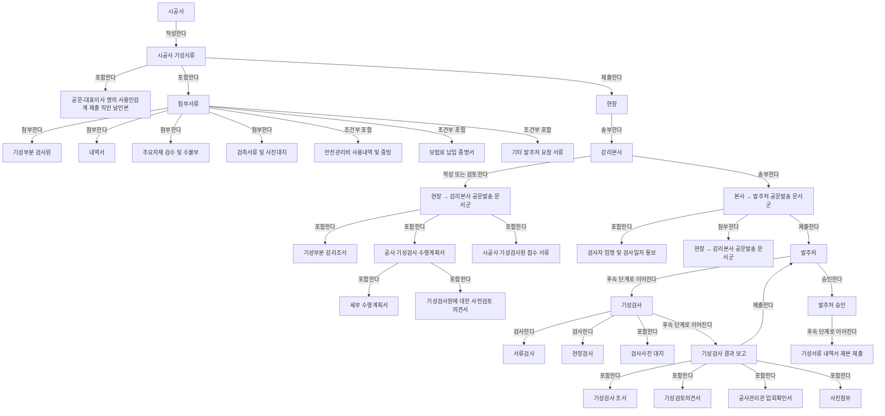
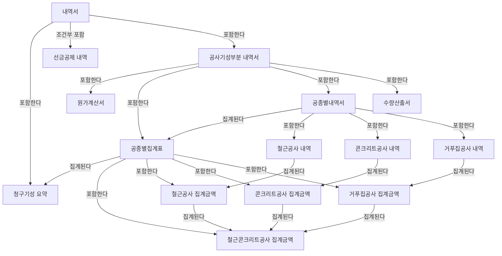
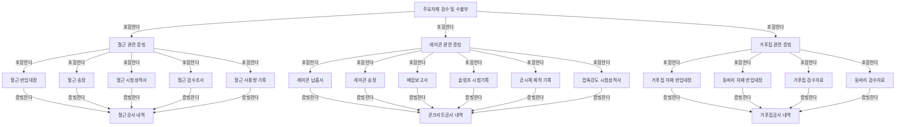
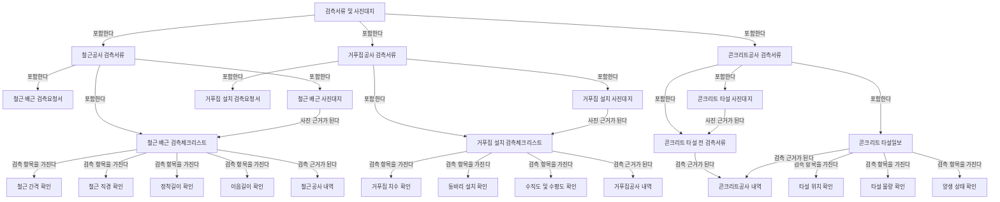

# 철근콘크리트 공종 기성서류 문서 흐름도 및 관계 라벨 정의

## 1. 목적

본 문서는 철근콘크리트 공종 기성서류의 문서 흐름을 온톨로지 구축 전 단계에서 정리하기 위한 문서이다.  
RDF/RDFS 형식으로 작성하지 않고, 문서가 어떤 순서로 작성·첨부·제출·검토·승인되는지와 문서 간 관계의 의미를 사람이 읽을 수 있는 방식으로 정의한다.

---

## 2. 노드 유형 구분

문서 흐름도에서 등장하는 항목은 모두 같은 성격이 아니므로 다음과 같이 구분한다.

| 유형 | 의미 | 예시 |
|---|---|---|
| 행위자 | 문서를 작성, 제출, 검토, 승인하는 주체 | 시공사, 현장, 감리본사, 본사, 발주처 |
| 문서군 | 여러 문서를 묶는 상위 단위 | 시공사 기성서류, 첨부서류, 내역서, 주요자재 검수 및 수불부 |
| 문서 | 실제 제출 또는 검토되는 개별 문서 | 공문, 기성부분 검사원, 공종별집계표, 기성검사 조서 |
| 내역 그룹 | 특정 공종의 내역 항목을 묶는 단위 | 철근공사 내역, 콘크리트공사 내역, 거푸집공사 내역 |
| 정보 필드 | 문서 내부의 속성값 | 품명, 규격, 금회수량, 단가, 금액 |
| 산출 항목 | 수량산출서 내부의 계산 대상 단위 | 철근 수량산출 항목, 콘크리트 수량산출 항목, 거푸집 수량산출 항목 |
| 검측 항목 | 검측문서에서 확인하는 세부 항목 | 철근 간격 확인, 정착길이 확인, 타설 위치 확인 |
| 절차 | 문서 처리 또는 업무 단계 | 서류검사, 현장검사, 발주처 승인, 제본 제출 |

---

## 3. 화살표 의미 정의

기존 흐름도에서 모든 관계를 `-->`로 표현하면 관계 의미가 섞이므로, 다음과 같이 화살표 라벨을 구분한다.

| 화살표 라벨 | 의미 | 사용 예 |
|---|---|---|
| 포함한다 | 상위 문서군이 하위 문서나 문서군을 포함함 | 첨부서류 → 내역서 |
| 첨부한다 | 제출 문서에 다른 문서가 첨부됨 | 시공사 기성서류 → 기성부분 검사원 |
| 제출한다 | 한 행위자가 다른 행위자에게 문서를 제출함 | 시공사 → 현장 |
| 송부한다 | 검토 또는 접수 후 다음 기관으로 문서를 보냄 | 현장 → 감리본사 |
| 검토한다 | 문서의 적정성을 검토함 | 감리본사 → 기성부분 감리조서 |
| 검사한다 | 서류 또는 현장을 검사함 | 기성검사 → 서류검사 |
| 승인한다 | 발주처가 검토 결과를 승인함 | 발주처 → 발주처 승인 |
| 후속 단계로 이어진다 | 절차상 다음 단계로 진행됨 | 기성검사 → 기성검사 결과 보고 |
| 집계된다 | 하위 금액 또는 내역이 상위 집계표로 합산됨 | 공종별내역서 → 공종별집계표 |
| 산출 근거가 된다 | 수량산출서가 내역 수량의 근거가 됨 | 철근 수량산출서 → 철근공사 내역 |
| 증빙한다 | 자재 증빙 문서가 내역 또는 공종의 근거가 됨 | 철근 시험성적서 → 철근공사 내역 |
| 검측 근거가 된다 | 검측서류가 시공 여부 확인 근거가 됨 | 철근 배근 검측체크리스트 → 철근공사 내역 |
| 사진 근거가 된다 | 사진대지가 검측 또는 검사 결과를 뒷받침함 | 철근 배근 사진대지 → 철근 배근 검측체크리스트 |
| 조건부 포함 | 특정 조건이 있을 때만 포함됨 | 선금공제 내역, 기타 발주처 요청 서류 |

---

## 4. 전체 문서 흐름도

---

## 5. 내역서 내부 흐름도

---

## 6. 공종별 내역 정보 필드 구조

공종별내역서는 문서이고, 철근공사 내역·콘크리트공사 내역·거푸집공사 내역은 공종별 내역 그룹이다.  
그 하위의 품명, 규격, 단위, 수량, 단가, 금액은 문서가 아니라 정보 필드이다.

```mermaid
flowchart TD
    A[공종별내역서] -->|포함한다| B1[철근공사 내역]
    A -->|포함한다| B2[콘크리트공사 내역]
    A -->|포함한다| B3[거푸집공사 내역]

    B1 -->|정보 필드를 가진다| F1[품명]
    B1 -->|정보 필드를 가진다| F2[규격]
    B1 -->|정보 필드를 가진다| F3[단위]
    B1 -->|정보 필드를 가진다| F4[계약수량]
    B1 -->|정보 필드를 가진다| F5[전회수량]
    B1 -->|정보 필드를 가진다| F6[금회수량]
    B1 -->|정보 필드를 가진다| F7[누계수량]
    B1 -->|정보 필드를 가진다| F8[단가]
    B1 -->|정보 필드를 가진다| F9[금액]

    B2 -->|정보 필드를 가진다| F1
    B2 -->|정보 필드를 가진다| F2
    B2 -->|정보 필드를 가진다| F3
    B2 -->|정보 필드를 가진다| F4
    B2 -->|정보 필드를 가진다| F5
    B2 -->|정보 필드를 가진다| F6
    B2 -->|정보 필드를 가진다| F7
    B2 -->|정보 필드를 가진다| F8
    B2 -->|정보 필드를 가진다| F9

    B3 -->|정보 필드를 가진다| F1
    B3 -->|정보 필드를 가진다| F2
    B3 -->|정보 필드를 가진다| F3
    B3 -->|정보 필드를 가진다| F4
    B3 -->|정보 필드를 가진다| F5
    B3 -->|정보 필드를 가진다| F6
    B3 -->|정보 필드를 가진다| F7
    B3 -->|정보 필드를 가진다| F8
    B3 -->|정보 필드를 가진다| F9
```

---

## 7. 수량산출서와 공종별내역서의 근거 흐름

```mermaid
flowchart TD
    A[수량산출서] -->|포함한다| A1[철근 수량산출서]
    A -->|포함한다| A2[콘크리트 수량산출서]
    A -->|포함한다| A3[거푸집 수량산출서]

    A1 -->|산출 근거가 된다| B1[철근공사 내역]
    A2 -->|산출 근거가 된다| B2[콘크리트공사 내역]
    A3 -->|산출 근거가 된다| B3[거푸집공사 내역]

    A1 -->|정보 필드를 가진다| C11[위치]
    A1 -->|정보 필드를 가진다| C12[부재명]
    A1 -->|정보 필드를 가진다| C13[철근 규격]
    A1 -->|정보 필드를 가진다| C14[철근 직경]
    A1 -->|정보 필드를 가진다| C15[길이]
    A1 -->|정보 필드를 가진다| C16[개수]
    A1 -->|정보 필드를 가진다| C17[단위중량]
    A1 -->|정보 필드를 가진다| C18[산출중량]

    A2 -->|정보 필드를 가진다| C21[위치]
    A2 -->|정보 필드를 가진다| C22[부재명]
    A2 -->|정보 필드를 가진다| C23[콘크리트 강도]
    A2 -->|정보 필드를 가진다| C24[길이]
    A2 -->|정보 필드를 가진다| C25[폭]
    A2 -->|정보 필드를 가진다| C26[높이]
    A2 -->|정보 필드를 가진다| C27[산출체적]

    A3 -->|정보 필드를 가진다| C31[위치]
    A3 -->|정보 필드를 가진다| C32[부재명]
    A3 -->|정보 필드를 가진다| C33[거푸집 종류]
    A3 -->|정보 필드를 가진다| C34[길이]
    A3 -->|정보 필드를 가진다| C35[높이]
    A3 -->|정보 필드를 가진다| C36[산출면적]
```

---

## 8. 자재 증빙 문서 흐름

---

## 9. 검측서류 및 사진대지 흐름

---

## 10. 필수·선택 문서 후보

아직 SHACL 제약으로 작성하는 단계는 아니지만, 향후 검증 규칙을 만들기 위해 문서의 필수성 후보를 구분한다.

| 구분 | 문서 또는 항목 | 판단 |
|---|---|---|
| 기본 포함 후보 | 공문 | 시공사 기성서류의 제출 문서 |
| 기본 포함 후보 | 기성부분 검사원 | 기성검사 요청 문서 |
| 기본 포함 후보 | 내역서 | 기성금액 산정 중심 문서 |
| 기본 포함 후보 | 공사기성부분 내역서 | 원가계산서, 집계표, 내역서, 수량산출서 포함 |
| 기본 포함 후보 | 공종별집계표 | 공종별 금액 집계 문서 |
| 기본 포함 후보 | 공종별내역서 | 공종별 수량·단가·금액 산정 문서 |
| 기본 포함 후보 | 수량산출서 | 공종별 수량 근거 문서 |
| 기본 포함 후보 | 주요자재 검수 및 수불부 | 자재 반입·검수·품질 증빙 문서군 |
| 기본 포함 후보 | 검측서류 및 사진대지 | 시공 확인 문서군 |
| 기본 포함 후보 | 기성부분 감리조서 | 감리 검토 문서 |
| 기본 포함 후보 | 기성검사 조서 | 검사 결과 문서 |
| 기본 포함 후보 | 발주처 승인 | 최종 승인 단계 |
| 조건부 포함 후보 | 선금공제 내역 | 선금 지급 또는 공제 대상이 있을 때 포함 |
| 조건부 포함 후보 | 안전관리비 사용내역 및 증빙 | 안전관리비 정산 또는 청구 대상이 있을 때 포함 |
| 조건부 포함 후보 | 보험료 납입 증명서 | 보험료 정산 또는 증빙 요구가 있을 때 포함 |
| 조건부 포함 후보 | 기타 발주처 요청 서류 | 발주처 요구 조건이 있을 때 포함 |

---

## 11. 값·자료형·단위가 필요한 정보 필드

향후 RDF 인스턴스와 SHACL 검증 규칙을 작성하려면 다음 정보 필드는 값의 자료형과 단위가 필요하다.

| 정보 필드 | 값 성격 | 필요한 단위 또는 기준 |
|---|---|---|
| 계약수량 | 수치 | 공종별 단위, 예: ton, m³, m², 개소 |
| 전회수량 | 수치 | 공종별 단위 |
| 금회수량 | 수치 | 공종별 단위 |
| 누계수량 | 수치 | 공종별 단위 |
| 단가 | 금액 | 원/단위, 통화 기준 |
| 금액 | 금액 | 원, 부가세 포함 여부 구분 필요 |
| 철근 직경 | 수치 | mm |
| 길이 | 수치 | m 또는 mm |
| 폭 | 수치 | m 또는 mm |
| 높이 | 수치 | m 또는 mm |
| 개수 | 수치 | 개 |
| 단위중량 | 수치 | kg/m 또는 kg/본 |
| 산출중량 | 수치 | kg 또는 ton |
| 콘크리트 강도 | 수치 | MPa |
| 산출체적 | 수치 | m³ |
| 산출면적 | 수치 | m² |

---

## 12. 실제 인스턴스 구축 시 필요한 출처 정보

향후 실제 RDF 데이터를 구축할 때는 각 문서와 값에 대해 다음 출처 정보를 함께 기록해야 한다.

| 출처 정보 | 설명 |
|---|---|
| 문서명 | 실제 문서 파일명 또는 문서 제목 |
| 문서 식별자 | 회차, 문서번호, 제출번호 등 |
| 작성일 또는 제출일 | 문서 생성 또는 제출 시점 |
| 작성 주체 | 시공사, 감리, 발주처 등 |
| 검토 주체 | 감리본사, 검사자, 발주처 등 |
| 원본 위치 | 파일명, 페이지, 시트명, 셀 주소 등 |
| 추출값 | 금액, 수량, 단가, 규격 등 실제 값 |
| 단위 | 값의 단위 또는 통화 |
| 관련 공종 | 철근, 콘크리트, 거푸집 |
| 관련 문서 | 산출서, 증빙자료, 검측서류, 사진대지 등 |

예시:

| 실제 인스턴스 | 출처 정보 예시 |
|---|---|
| 제13회 기성검사 조서 | 파일명, 문서번호, 제출일, 발주처 승인 여부 |
| 기성 세부내역.xlsx | 시트명, 행 번호, 품명, 규격, 금회수량, 단가, 금액 |
| 철근 수량산출서 | 페이지, 위치, 부재명, 철근 직경, 길이, 산출중량 |
| 철근 배근 사진대지 | 파일명, 촬영 위치, 촬영일, 관련 검측체크리스트 |

---

## 13. 비교 평가를 위한 후속 기준

본 문서 흐름도는 RDF/RDFS 구축 전 구조화 단계의 산출물이다.  
향후 RDF/RDFS, RDF/RDFS+SKOS, RDF/RDFS+OWL 2 RL, RDF/RDFS+OWL 2 DL, RDF/RDFS+SHACL 모델을 비교하기 위해 다음 기준을 사용할 수 있다.

| 평가 기준 | 설명 |
|---|---|
| 문서 계층 표현성 | 문서군, 문서, 하위 문서를 잘 표현하는가 |
| 문서 흐름 표현성 | 제출, 송부, 검토, 승인 흐름을 표현하는가 |
| 산정 근거 추적성 | 내역서에서 수량산출서까지 추적 가능한가 |
| 증빙 연결성 | 내역 항목과 자재 증빙 문서가 연결되는가 |
| 검측 연결성 | 내역 항목과 검측서류, 사진대지가 연결되는가 |
| 정보 필드 구분성 | 문서와 정보 필드를 구분하는가 |
| 값 검증 가능성 | 수량, 금액, 단위, 자료형 검증이 가능한가 |
| 조건부 문서 표현성 | 선금공제, 기타 요청 서류 등 조건부 문서를 표현하는가 |
| 실제 인스턴스 적용성 | 실제 기성문서의 값과 출처를 연결할 수 있는가 |
| 재사용성 | 다른 공종 또는 다른 기성 회차에 확장 가능한가 |

---

## 14. 정리

이 문서 흐름도에서는 단순한 포함 관계뿐 아니라 다음 관계를 구분하였다.

- 포함한다
- 첨부한다
- 제출한다
- 송부한다
- 검토한다
- 검사한다
- 승인한다
- 후속 단계로 이어진다
- 집계된다
- 산출 근거가 된다
- 증빙한다
- 검측 근거가 된다
- 사진 근거가 된다
- 조건부 포함

이 구분은 향후 RDF/RDFS 구축 시 문서 간 관계 속성을 정의하기 위한 전 단계이며, SHACL 또는 OWL 확장 모델에서 필수성, 조건부 포함, 자료형, 단위, 검증 규칙을 추가하는 기준으로 활용할 수 있다.
